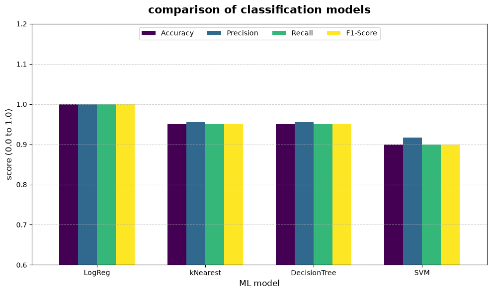
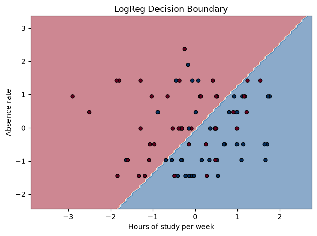
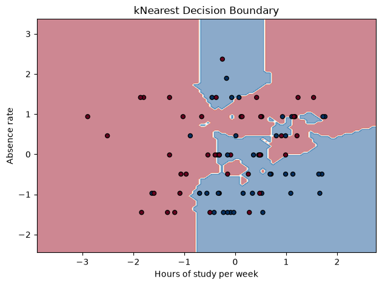
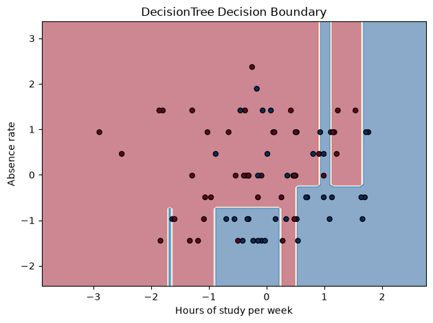
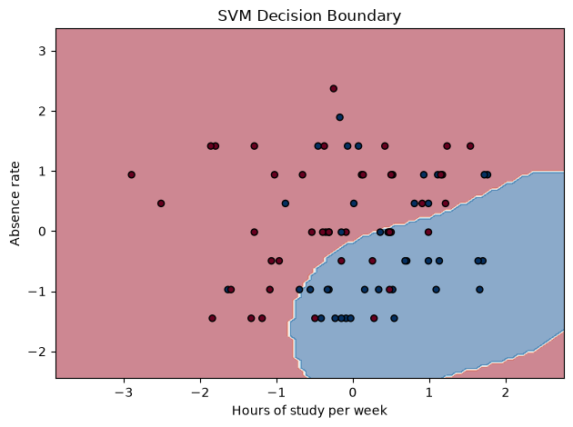

# Problem
- Target Variable (y): Final outcome (1 for Success, 0 for Failure).
- Input Features (X): Hours of study per week, Absence rate, Math grade average, French grade average, Class participation score.
- Task Type: Binary Classification, as the goal is to map the continuous and categorical input features to one of two discrete, mutually exclusive classes (Success or Failure).


```python
# modules and libraries
import pandas as pd
import numpy as np
import matplotlib.pyplot as plt
from sklearn.model_selection import train_test_split
from sklearn.preprocessing import StandardScaler
from sklearn.linear_model import LogisticRegression
from sklearn.neighbors import KNeighborsClassifier
from sklearn.tree import DecisionTreeClassifier
from sklearn.svm import SVC
from sklearn.metrics import accuracy_score, classification_report
from sklearn.inspection import DecisionBoundaryDisplay
print("Imported")
```

    Imported


```python
import pandas as pd
import numpy as np

# set random seed for reproducibility
np.random.seed(42)

# students number
n_students = 100

# generate base features
# study hours (normal distribution around 15 hours, some intentional negative typos)
study_hours = np.random.normal(loc=15, scale=5, size=n_students)
study_hours[10] = -2.5  # Intentional negative value for testing
study_hours[42] = -5.0  # Intentional negative value for testing

# absences (Poisson distribution, mostly 0-5 absences, some negative typos)
absences = np.random.poisson(lam=3, size=n_students)
absences[15] = -1  # Intentional negative value
absences[99] = -3  # Intentional negative value

# Math and French grades (0 to 20 French scale)
math_grades = np.random.normal(loc=12, scale=3, size=n_students)
french_grades = np.random.normal(loc=11, scale=3, size=n_students)

# Clip grades to ensure they stay strictly within 0-20 bounds
math_grades = np.clip(math_grades, 0, 20)
french_grades = np.clip(french_grades, 0, 20)

# Participation score (0 to 10)
participation = np.random.randint(0, 11, size=n_students)

# 2. Determine Final Outcome (Success/Failure)
# We create a hidden "success score" to make the classification realistic.
# Higher grades, higher participation, more study, and fewer absences = better chance of success.
success_probability = (
    (study_hours * 0.5) - 
    (absences * 1.2) + 
    (math_grades * 2.0) + 
    (french_grades * 1.5) + 
    (participation * 1.0)
)

# Normalize probabilities roughly between 0 and 1, then convert to 1 (Pass) or 0 (Fail)
# We use the median as a threshold to get roughly 50% pass rate
threshold = np.median(success_probability)
final_outcome = (success_probability >= threshold).astype(int)

df = pd.DataFrame({
    'Hours of study per week': np.round(study_hours, 1),
    'Absence rate': absences,
    'Math grade average': np.round(math_grades, 1),
    'French grade average': np.round(french_grades, 1),
    'Class participation score': participation,
    'Final outcome': final_outcome
})

df.to_csv('/home/rohitsolanki/programs/jupyter/data/StudentSuccess.csv', index=False)
print("StudentSuccess.csv successfully created with 100 rows!")
display(df.head(15))
```

    StudentSuccess.csv successfully created with 100 rows!


<div>
<style scoped>
    .dataframe tbody tr th:only-of-type {
        vertical-align: middle;
    }

    .dataframe tbody tr th {
        vertical-align: top;
    }

    .dataframe thead th {
        text-align: right;
    }
</style>
<table border="1" class="dataframe">
  <thead>
    <tr style="text-align: right;">
      <th></th>
      <th>Hours of study per week</th>
      <th>Absence rate</th>
      <th>Math grade average</th>
      <th>French grade average</th>
      <th>Class participation score</th>
      <th>Final outcome</th>
    </tr>
  </thead>
  <tbody>
    <tr>
      <th>0</th>
      <td>17.5</td>
      <td>2</td>
      <td>7.9</td>
      <td>11.1</td>
      <td>3</td>
      <td>0</td>
    </tr>
    <tr>
      <th>1</th>
      <td>14.3</td>
      <td>4</td>
      <td>13.6</td>
      <td>11.4</td>
      <td>9</td>
      <td>1</td>
    </tr>
    <tr>
      <th>2</th>
      <td>18.2</td>
      <td>4</td>
      <td>15.2</td>
      <td>9.9</td>
      <td>10</td>
      <td>1</td>
    </tr>
    <tr>
      <th>3</th>
      <td>22.6</td>
      <td>2</td>
      <td>16.6</td>
      <td>10.3</td>
      <td>10</td>
      <td>1</td>
    </tr>
    <tr>
      <th>4</th>
      <td>13.8</td>
      <td>2</td>
      <td>9.5</td>
      <td>9.6</td>
      <td>4</td>
      <td>0</td>
    </tr>
    <tr>
      <th>5</th>
      <td>13.8</td>
      <td>3</td>
      <td>11.1</td>
      <td>9.1</td>
      <td>3</td>
      <td>0</td>
    </tr>
    <tr>
      <th>6</th>
      <td>22.9</td>
      <td>5</td>
      <td>12.7</td>
      <td>9.9</td>
      <td>10</td>
      <td>1</td>
    </tr>
    <tr>
      <th>7</th>
      <td>18.8</td>
      <td>5</td>
      <td>18.1</td>
      <td>9.8</td>
      <td>9</td>
      <td>1</td>
    </tr>
    <tr>
      <th>8</th>
      <td>12.7</td>
      <td>3</td>
      <td>12.3</td>
      <td>8.5</td>
      <td>7</td>
      <td>0</td>
    </tr>
    <tr>
      <th>9</th>
      <td>17.7</td>
      <td>2</td>
      <td>16.7</td>
      <td>9.4</td>
      <td>5</td>
      <td>1</td>
    </tr>
    <tr>
      <th>10</th>
      <td>-2.5</td>
      <td>3</td>
      <td>12.5</td>
      <td>3.5</td>
      <td>5</td>
      <td>0</td>
    </tr>
    <tr>
      <th>11</th>
      <td>12.7</td>
      <td>3</td>
      <td>15.5</td>
      <td>13.1</td>
      <td>7</td>
      <td>1</td>
    </tr>
    <tr>
      <th>12</th>
      <td>16.2</td>
      <td>1</td>
      <td>15.1</td>
      <td>12.2</td>
      <td>6</td>
      <td>1</td>
    </tr>
    <tr>
      <th>13</th>
      <td>5.4</td>
      <td>6</td>
      <td>12.5</td>
      <td>10.7</td>
      <td>9</td>
      <td>0</td>
    </tr>
    <tr>
      <th>14</th>
      <td>6.4</td>
      <td>1</td>
      <td>8.9</td>
      <td>11.7</td>
      <td>10</td>
      <td>0</td>
    </tr>
  </tbody>
</table>
</div>


```python
import os
print("Jupyter is currently running in:", os.getcwd())
print("Files/folders here:", os.listdir())
```

    Jupyter is currently running in: /home/rohitsolanki/programs/jupyter
    Files/folders here: ['.git', 'outputs', '.ipynb_checkpoints', '.venv', 'notebooks', 'README.md', '.gitignore', 'data', 'requirements.txt']


```python
df = df.clip(lower=0)

# Problem Formulation
# target: Final outcome (0 or 1)
# features: Study hours, Absences, Math grade, French grade, Participation
X = df[['Hours of study per week', 'Absence rate', 'Math grade average', 
        'French grade average', 'Class participation score']]
y = df['Final outcome']
```


```python
# split the dataset into training and test sets (80% train, 20% test)
X_train, X_test, y_train, y_test = train_test_split(X, y, test_size=0.2, random_state=42)

# scale features to mean=0 and variance=1 (Critical for k-NN and SVM)
scaler = StandardScaler()
X_train_scaled = scaler.fit_transform(X_train)
X_test_scaled = scaler.transform(X_test)
```


```python
# Create an empty list to store the scores for each model
results_list = []

# Train and evaluate each model
for name, model in models.items():
    model.fit(X_train_scaled, y_train)
    y_pred = model.predict(X_test_scaled)
    
    # Generate the report as a dictionary
    report = classification_report(y_test, y_pred, zero_division=0, output_dict=True)
    
    # Extract the metrics we care about and add them to our list
    results_list.append({
        "Model": name,
        "Accuracy": report["accuracy"],
        "Precision": report["weighted avg"]["precision"],
        "Recall": report["weighted avg"]["recall"],
        "F1-Score": report["weighted avg"]["f1-score"]
    })

output_df = pd.DataFrame(results_list)

display(output_df)
```


<div>
<style scoped>
    .dataframe tbody tr th:only-of-type {
        vertical-align: middle;
    }

    .dataframe tbody tr th {
        vertical-align: top;
    }

    .dataframe thead th {
        text-align: right;
    }
</style>
<table border="1" class="dataframe">
  <thead>
    <tr style="text-align: right;">
      <th></th>
      <th>Model</th>
      <th>Accuracy</th>
      <th>Precision</th>
      <th>Recall</th>
      <th>F1-Score</th>
    </tr>
  </thead>
  <tbody>
    <tr>
      <th>0</th>
      <td>LogReg</td>
      <td>1.00</td>
      <td>1.000000</td>
      <td>1.00</td>
      <td>1.000000</td>
    </tr>
    <tr>
      <th>1</th>
      <td>kNearest</td>
      <td>0.95</td>
      <td>0.954545</td>
      <td>0.95</td>
      <td>0.949875</td>
    </tr>
    <tr>
      <th>2</th>
      <td>DecisionTree</td>
      <td>0.95</td>
      <td>0.954545</td>
      <td>0.95</td>
      <td>0.949875</td>
    </tr>
    <tr>
      <th>3</th>
      <td>SVM</td>
      <td>0.90</td>
      <td>0.916667</td>
      <td>0.90</td>
      <td>0.898990</td>
    </tr>
  </tbody>
</table>
</div>


```python
# set the 'Model' column as the index so it acts as our X-axis labels
plot_df = output_df.set_index('Model')

# create a grouped bar chart
ax = plot_df.plot(kind='bar', figsize=(10, 6), colormap='viridis', width=0.7)

# format the plot for readability
plt.title('comparison of classification models', fontsize=16, fontweight='bold', pad=15)
plt.xlabel('ML model', fontsize=12)
plt.ylabel('score (0.0 to 1.0)', fontsize=12)

# set y-axis limit a bit above 1.0 to leave room for the legend
plt.ylim(0.6, 1.2) 
plt.xticks(rotation=0) 
plt.legend(loc='upper center', ncol=4) 
plt.grid(axis='y', linestyle='--', alpha=0.6)

plt.tight_layout()
plt.show()
```


    

    


```python
# Loop through and create a completely separate plot for each model
for name, model in models.items():
    # 1. Create a new, separate figure
    plt.figure(figsize=(6, 5))
    
    # 2. Retrain model on just the 2 selected features
    model.fit(X_train_2d_scaled, y_train)
    
    # 3. Plot the background decision regions
    # (By removing the 'ax=' argument, it automatically uses the new figure)
    DecisionBoundaryDisplay.from_estimator(
        model, X_train_2d_scaled, response_method="predict", 
        cmap=plt.cm.RdBu, alpha=0.5, 
        xlabel=features_2d[0], ylabel=features_2d[1]
    )
    
    # overlay the actual training data points, blue = pass
    scatter = plt.scatter(X_train_2d_scaled[:, 0], X_train_2d_scaled[:, 1], 
                          c=y_train, cmap=plt.cm.RdBu, edgecolors='black', s=25)
    
    # 5. Add title and the simple legend we discussed earlier
    plt.title(f"{name} Decision Boundary")
    # 6. Display this specific plot, then close it to make room for the next one
    plt.tight_layout()
    plt.show()
    plt.close()
```


    <Figure size 600x500 with 0 Axes>


    

    


    <Figure size 600x500 with 0 Axes>


    

    


    <Figure size 600x500 with 0 Axes>


    

    


    <Figure size 600x500 with 0 Axes>


    

    


```python

```
